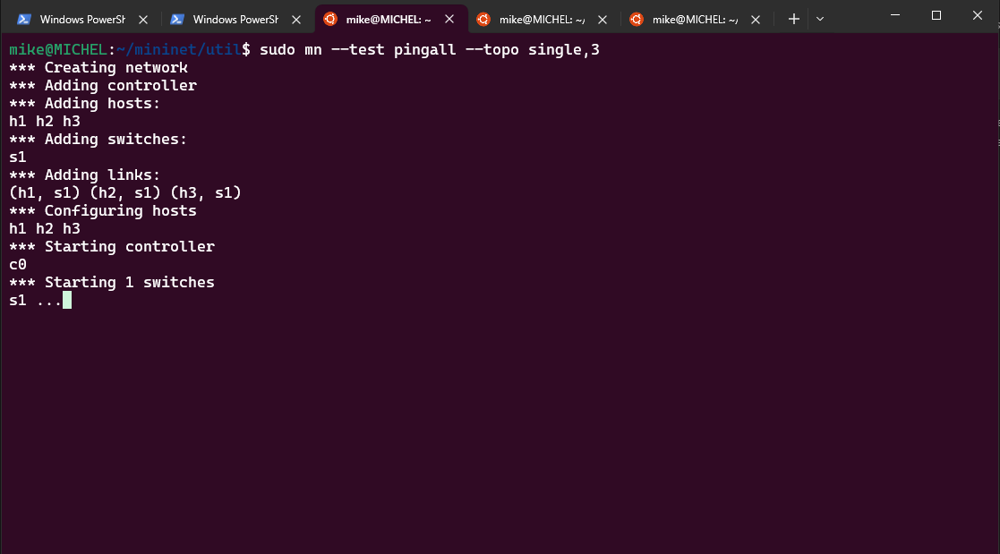
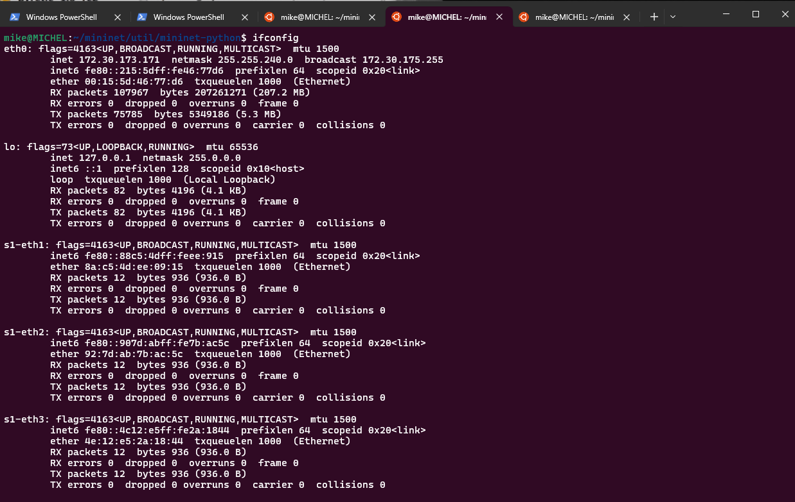
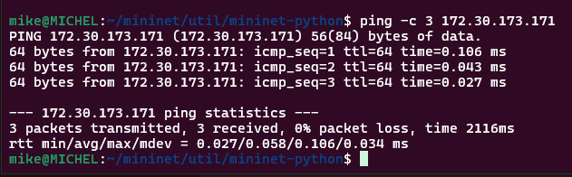
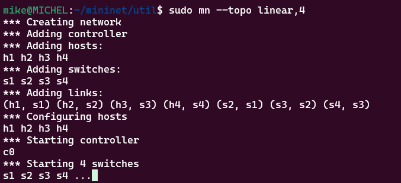
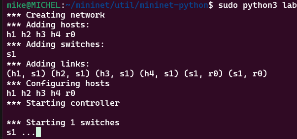
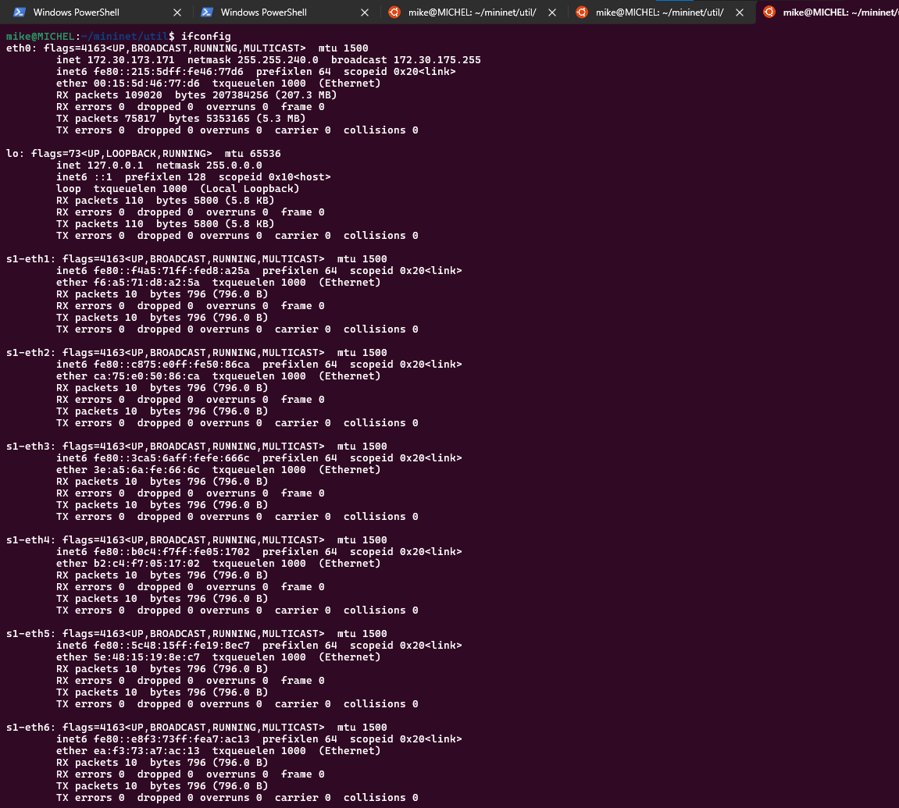

# Mininet and Virtualization using Python APIs

## Testing a simple Mininet setup

Setting up a simple topology with 4 hosts connected to a single switch:

```bash
sudo mn --test pingall --topo single,3
```

This setup uses a default switch controller and switch.  
Mininet also allows you to use custom remote controllers (and custom switches).



for the best experience use a _virtualization_ platform such as **VMware station** or **Oracle Virtual Box**, in our case, we used **Windows Hypervisor** to run _Linux Ubuntu_ on top of WSL2 [(windows subsystem for Linux version 2)](!https://learn.microsoft.com/en-us/windows/wsl/install)

Execute the below command to have details about the topology created:

```bash
ifconfig
```

for our example the results are shown as below:  


the IP Address of eth0 is 172.30.173.171  
let's check the connectivity throug ping using this command:

```bash
ping -c 3 172.30.173.171
```

**-c** is a flag we are indicating that we will check for 3 packets.

the results are shown as below:



We can create different topologies in mininet

- Minimal network with 2 hosts, one switch, **sudo mn --topo minimal**
- linear with 4 hosts and 4 switches **sudo mn --topo linear, 4**



## Mininet Python API Walkthrough

Creating a linear topology:

```python
from mininet.net import Mininet
from mininet.topo import LinearTopo

linear = LinearTopo(k=4)
net = Mininet(topo=linear)

net.start()
net.pingAll()
net.stop()
```

script file can be found in `./scripts/sample.py`
to run the script execute the following:

```bash
sudo python3 sample.py
```

### An example of a network with two vlans connected by router

```bash
#!/usr/bin/python

from __future__ import print_function

import os
from mininet.topo import Topo
from mininet.net import Mininet
from mininet.node import Node
from mininet.log import setLogLevel, info
from mininet.cli import CLI
from mininet.link import Intf
from mininet.node import Controller

class LinuxRouter( Node ):
    # Turns host into IP router
    def config( self, **params ):
        super( LinuxRouter, self).config( **params )
        # Enable forwarding on the router
        self.cmd( 'sysctl net.ipv4.ip_forward=1' )

    def terminate( self ):
        self.cmd( 'sysctl net.ipv4.ip_forward=0' )
        super( LinuxRouter, self ).terminate()

class NetworkTopo( Topo ):
    # Class that builds network topology consisting of four hosts, one router, three switches
    def build( self, **_opts ):

        router = self.addNode( 'r0', cls=LinuxRouter, ip='192.168.1.1/24' )

        s1 = self.addSwitch( 's1', failMode='standalone' )

        self.addLink( s1, router, intfName2='r0-eth1',
                      params2={ 'ip' : '192.168.1.1/24' } )

        self.addLink( s1, router, intfName2='r0-eth2',
                      params2={ 'ip' : '192.168.2.1/24' } )

        h1 = self.addHost( 'h1', ip='192.168.1.100/24',
                           defaultRoute='via 192.168.1.1' )

        h2 = self.addHost( 'h2', ip='192.168.2.100/24',
                           defaultRoute='via 192.168.2.1')

        h3 = self.addHost( 'h3', ip='192.168.1.101/24',
                           defaultRoute='via 192.168.1.1' )

        h4 = self.addHost( 'h4', ip='192.168.2.101/24',
                           defaultRoute='via 192.168.2.1' )

        for h, s in [ (h1, s1), (h2, s1), (h3, s1), (h4, s1) ]:
            self.addLink( h, s )

def run():

    topo = NetworkTopo()

    net = Mininet( topo=topo, controller=None )

    net.start()

    # Configure vlans on switch
    net[ 's1' ].cmd( './lab2.sh' )

    CLI( net )
    net.stop()

if __name__ == '__main__':
    setLogLevel( 'info' )
    run()
```



as a result we see:  

